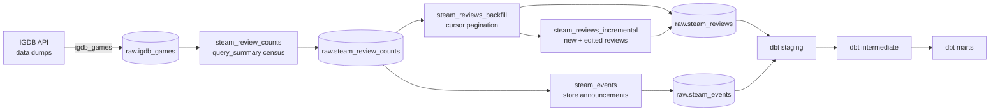

[](https://github.com/Arkhemis/steam-reviews-analysis/actions)
[](https://github.com/Arkhemis/steam-reviews-analysis/actions)
[](https://www.python.org/downloads/)


![SQLFluff](https://img.shields.io/badge/SQLFluff-71a9c0?logo=data:image/png;base64,iVBORw0KGgoAAAANSUhEUgAAAEAAAABACAYAAACqaXHeAAAACXBIWXMAAA7DAAAOwwHHb6hkAAAAGXRFWHRTb2Z0d2FyZQB3d3cuaW5rc2NhcGUub3Jnm+48GgAAAoJJREFUeJztmj9rFEEcht/RmFYwYFA0goW9EqIBsfQTGPxTWGonKEEbRcFCP4AIdoqokEoRFYJYnCAqiLUIFpHYBS4oYgK5x2LuIHfunbt7M/vLXeZp93b2fd6dHW7nTtpkAIeA18AO6yyV05RfwvNpU5UATAF12pm3zlUJHXe+RR04bJ0tOkk+ySf5JJ/kk/yQk+STfJJP8kk+yQ85ST7JJ/kkn+ST/JCT5JN8kq9c3sUcHNgvaVrSHkkNSd8l1ZxzP5rHpyTNS9q+7rRlScedcx9jZosKcBSokc0a8Ao4y7+/1dWbpQwmgAOuAI0u8r0Y7Ge+KX+nhLip/JZQAznnkPSz5OkXnHMfQmUxBbhVYga8tM5dCGAc/6x/AY5lHL9ZsIA1YLeFSyHw/7J4BKysC78MTGd8tuhMOGnh9F+AbcBp4H2P8CFKuGzh1xVgJ3AVWMwp0G8JG6MA4CBwD/hd4O61+EX5NeGUhW8r4AgwA7wtId1JmZnQACYs3AXMAgsBxPsp4Y2FeyvUXGD5oiU0sj5XGcCRSAXkLeG6hXdnoGdGJdwFor6S5wLYh1/Bqy7BXr4FcCliAV1L2DDgX2efRi4h83uCJW1TEBiT9FnS3ojX/OqcOxBx/EK07Qc455YknZC0GvGajyOOHQbgfKRHYAXYZe2XC+B2hAIeWnvlBr8oPghcwGDt+AJbgSeB5N9Z+5QCGAWeByjgjLVLafC7Qv28NC0Co9YefYF/HMquCdes8wcBvzDeKCj/Bxi3zh4U4BywmrOA+9Z5owBMAt9yFDBpnTUawBjwood8zTpjdPDrwkWy9xNmrPNVBjBB++v0AjBinaty8HuMc8CsdZY8/AXawSgA4YAIrgAAAABJRU5ErkJggg==&logoColor=white)
[](https://creativecommons.org/licenses/by/4.0/)

# Steam Reviews Analysis

End-to-end data pipeline that ingests Steam games, reviews and store announcements to derive statistics from them (sentiment over time, review trends, distinctive vocabulary per game, comparisons between games). A personal project, meant to work both as a practical tool and as a technical showcase of a modern pipeline: API ingestion → Postgres warehouse → dbt transformation, all orchestrated, scheduled and tested by Dagster.

## Repo structure

```
orchestration/      # Dagster code location
  igdb/             #   IGDB dumps: asset, resource, job, schedule
  steam/            #   Steam: census, backfill, incremental, events + resource
  dbt/              #   dbt assets (one @dbt_assets over the whole project) + per-layer jobs
  jobs.py           #   daily_pipeline, the cross-domain job
  schedules.py      #   its schedule (midnight Europe/Paris)
dbt/                # dbt project: sources, staging, intermediate, marts, macros, analyses
db/init.sql         # DDL for the raw schema, run on Postgres' first startup
deploy/             # Dagster config (dagster.yaml, workspace.yaml), Caddyfile, VPS cloud-init
.github/workflows/  # CI (ruff, sqlfluff, dg check defs) and CD (SSH deploy to the VPS)
```

## Pipeline



### Ingestion (Dagster assets)

1. **`igdb_games`** — downloads the IGDB data dumps (`games`, `external_games`, `genres`, `companies`, `involved_companies`, `covers`), keeps only games linked to a `steam_app_id`, and upserts them into `raw.igdb_games` with resolved genres, studios, publishers and cover URL.
2. **`steam_review_counts`** — fetches the Steam summary (`query_summary`: total reviews, score…) of every game that is *due*: nightly for games above 1 000 reviews or whose counters moved the day before, otherwise one fixed weekday per game so the quiet long tail is spread over seven nights. `full_refresh` in the Launchpad probes everything.
3. **`steam_reviews_backfill`** — first load of a game: paginates `appreviews` by cursor and writes the full payload of every review into `raw.steam_reviews`, stopping within a tolerance of the census count (Steam never serves some of the reviews it counts).
4. **`steam_reviews_incremental`** — nightly catch-up for games already backfilled: walks the `updated`-sorted pages until it reaches the last seen `timestamp_updated`, so both new reviews and edits of old ones land as new versions.
5. **`steam_events`** — store announcements (patch notes, updates, news) of games above the review threshold; recent page only for games already ingested, full history on `full_refresh`.

### Transformation (dbt)

- **staging** — `steam_review`, `steam_event`, `igdb_game`, `game_review_count`: flatten and type the raw JSON, and deduplicate reviews down to their latest version. Materialized as **columnar** tables — the raw review table alone is ~180 M rows.
- **intermediate** — `steam_review_agg` (playtime medians, Steam Deck and refund shares), `language_review_score`, `steam_event_categorized`, and `review_lexeme_count` (the single NLP tokenization pass, tagged `nlp`).
- **marts** — `game_stats`, `game_review_trend_daily`, its two rollups `catalogue_review_trend_daily` (one row per day, all games) and `game_window_score` (one row per game and window: week, 30 days, year to date), which spare a consumer from re-aggregating a year of `(game, day)`, `review_highlight`, `game_event_highlight`, `language_review_score_global`, and `game_distinctive_term` (log-odds with an informative Dirichlet prior, Monroe et al. 2008 — the vocabulary that sets a game apart from the corpus, positive and negative reviews separately; tagged `nlp`).

## Jobs and schedules

| Job | Trigger | Scope |
| --- | --- | --- |
| `daily_pipeline` | every day at midnight, Europe/Paris (on by default) | everything except the `nlp` assets |
| `igdb_ingest_job` | every day at 03:00 | `igdb_games` alone |
| `steam_census_full_refresh` | manual | probes every game, ignoring per-game frequency |
| `steam_events_full_refresh` | manual | rescans the full announcement history |
| `dbt_build` / `dbt_staging` / `dbt_intermediate` / `dbt_marts` | manual | `dbt build` on the whole project or one layer |
| `dbt_full_refresh` | manual | whole dbt project, `--full-refresh` |

The NLP models are excluded from the nightly run through their `nlp` tag: they cost hours for a result that does not need to be recomputed every night.

## Stack

- **Dagster** for orchestration (assets, resources, jobs, schedules), with `DockerRunLauncher`: one container per run, built from the `user-code` image.
- **dbt** for SQL transformations (staging → intermediate → marts), linted with SQLFluff.
- **PostgreSQL 16 + Citus columnar** as the warehouse — the review table is columnar, which is what keeps ~180 M full JSON payloads on a single VPS disk.
- **Docker Compose** to run the whole stack (Postgres, user-code gRPC server, webserver, daemon), **Caddy** in front of the deployed webserver.
- **uv** for Python dependency management, **ruff** + **pre-commit** for linting.

## Running the project

Copy and edit `.env.example`. You'll need valid IGDB (Twitch) credentials to fetch the game dumps:

```bash
cp .env.example .env
docker compose up -d
```

The Dagster webserver is served on `http://localhost:3001`. The `raw` schema is created on Postgres' first startup (`db/init.sql`).

The stack ships no bind mount for the application code: each run executes in its own container built from the `user-code` image, so a code change needs `docker compose up -d --build` to be picked up.

For local development (without Docker for the Dagster code):

```bash
uv sync --group dev
uv run dbt deps --project-dir dbt --profiles-dir dbt
uv run dg dev
uv run dbt build --project-dir dbt --profiles-dir dbt
```

## Progress

- [x] IGDB ingestion (game list, Steam mapping, genres/companies/covers)
- [x] Steam census (summaries) with per-game refresh frequency
- [x] Full review backfill + nightly incremental sync
- [x] Steam store announcements ingestion
- [x] dbt staging (cleaned, typed, deduplicated reviews) with source tests
- [x] dbt intermediate + marts (game stats, review trends, highlights, language scores, event highlights)
- [x] NLP: tokenization and distinctive terms per game (log-odds, powers the word clouds of steam-reviews-website)
- [x] Daily schedule of the full pipeline
- [x] CI (ruff, sqlfluff, `dg check defs`) and CD (deploy to the VPS on green `main`)
- [ ] Python tests on business logic (resources, casts)
- [ ] `dbt build` / `dbt test` run in CI
- [ ] Dagster alerting
