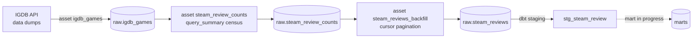

[](https://github.com/Arkhemis/steam-reviews-analysis/actions)
[](https://github.com/Arkhemis/steam-reviews-analysis/actions)
[](https://www.python.org/downloads/)


![SQLFluff](https://img.shields.io/badge/SQLFluff-71a9c0?logo=data:image/png;base64,iVBORw0KGgoAAAANSUhEUgAAAEAAAABACAYAAACqaXHeAAAACXBIWXMAAA7DAAAOwwHHb6hkAAAAGXRFWHRTb2Z0d2FyZQB3d3cuaW5rc2NhcGUub3Jnm+48GgAAAoJJREFUeJztmj9rFEEcht/RmFYwYFA0goW9EqIBsfQTGPxTWGonKEEbRcFCP4AIdoqokEoRFYJYnCAqiLUIFpHYBS4oYgK5x2LuIHfunbt7M/vLXeZp93b2fd6dHW7nTtpkAIeA18AO6yyV05RfwvNpU5UATAF12pm3zlUJHXe+RR04bJ0tOkk+ySf5JJ/kk/yQk+STfJJP8kk+yQ85ST7JJ/kkn+ST/JCT5JN8kq9c3sUcHNgvaVrSHkkNSd8l1ZxzP5rHpyTNS9q+7rRlScedcx9jZosKcBSokc0a8Ao4y7+/1dWbpQwmgAOuAI0u8r0Y7Ge+KX+nhLip/JZQAznnkPSz5OkXnHMfQmUxBbhVYga8tM5dCGAc/6x/AY5lHL9ZsIA1YLeFSyHw/7J4BKysC78MTGd8tuhMOGnh9F+AbcBp4H2P8CFKuGzh1xVgJ3AVWMwp0G8JG6MA4CBwD/hd4O61+EX5NeGUhW8r4AgwA7wtId1JmZnQACYs3AXMAgsBxPsp4Y2FeyvUXGD5oiU0sj5XGcCRSAXkLeG6hXdnoGdGJdwFor6S5wLYh1/Bqy7BXr4FcCliAV1L2DDgX2efRi4h83uCJW1TEBiT9FnS3ojX/OqcOxBx/EK07Qc455YknZC0GvGajyOOHQbgfKRHYAXYZe2XC+B2hAIeWnvlBr8oPghcwGDt+AJbgSeB5N9Z+5QCGAWeByjgjLVLafC7Qv28NC0Co9YefYF/HMquCdes8wcBvzDeKCj/Bxi3zh4U4BywmrOA+9Z5owBMAt9yFDBpnTUawBjwood8zTpjdPDrwkWy9xNmrPNVBjBB++v0AjBinaty8HuMc8CsdZY8/AXawSgA4YAIrgAAAABJRU5ErkJggg==&logoColor=white)
[](https://creativecommons.org/licenses/by/4.0/)

# Steam Reviews Analysis

End-to-end data pipeline that ingests Steam games and reviews to derive statistics from them (e.g. sentiment anaylsis, trends over time, comparisons between games). A personal project, meant to work both as a practical tool and as a technical showcase of a modern pipeline: API ingestion → Postgres warehouse → dbt transformation, all orchestrated and tested automatically by Dagster.

## Repo structure

```
orchestration/     # Dagster code: assets, resources (Postgres/Steam/IGDB), jobs, schedules
dbt/                # dbt project: sources, staging models (marts coming soon)
db/init.sql         # DDL for the raw schema, run on Postgres' first startup
deploy/             # Dagster config (dagster.yaml, workspace.yaml)
```

## Pipeline



1. **`igdb_games`** — downloads the IGDB data dumps (`games`, `external_games`), keeps only games linked to a `steam_app_id`, and upserts them into `raw.igdb_games`.
2. **`steam_review_counts`** — for each game, fetches the Steam summary (`query_summary`: total reviews, score...).
3. **`steam_reviews_backfill`** — paginates the Steam API (`appreviews`) and loads the full payload of every review into `raw.steam_reviews`, upserting a row only if the review is more recent.
4. **dbt (staging)** — `stg_steam_review` flattens and types the raw review JSON (casts, renaming, etc.).
5. **dbt (marts)** — in progress.

## Stack

- **Dagster** for orchestration (assets, resources, daily schedule).
- **dbt** for SQL transformations (staging → marts), linted with SQLFluff.
- **PostgreSQL** as the warehouse.
- **Docker Compose** to run the whole stack (Postgres, Dagster code, webserver, daemon).
- **uv** for Python dependency management, **ruff** + **pre-commit** for linting.

## Running the project

Copy and edit `.env.example`. You'll need a valid IGDB API key to fetch games dumps:
```bash
cp .env.example .env   
docker compose up -d
```

The Dagster webserver is served on `http://localhost:3001`. The `raw` schema is created on Postgres' first startup (`db/init.sql`).

For local development (without Docker for the Dagster code):

```bash
uv sync --group dev
uv run dg dev         
uv run dbt run --project-dir dbt --profiles-dir dbt
```


## Progress

- [x] IGDB ingestion (game list + Steam mapping)
- [x] Steam census (summaries) + full review backfill
- [x] dbt staging (cleaned, typed reviews) with source tests
- [x] CI (ruff, sqlfluff)
- [ ] dbt marts (actionable metrics) — **in progress**
- [ ] NLP tokenization asset (per-language, routed via the `language` field: powers word clouds / text-based marts for steam-reviews-website)
- [ ] Python tests on business logic (resources, casts)
- [ ] `dbt build`/`dbt test` run in CI
- [ ] Dagster alerting